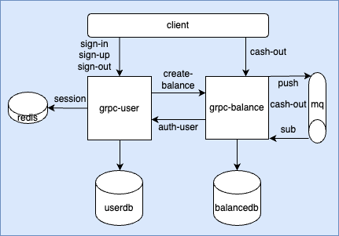

# Transaction services

## The following concepts are applied in app:
- <a href="https://github.com/bufbuild/connect-go">Connect-go</a> Framework (grpc)
- Clean Architecture
- Postgres <a href="https://github.com/jmoiron/sqlx">sqlx</a>.
- Broker <a href="https://nats.io/">nats</a> JetStream
- Stateful Auth (redis)  
- Graceful Shutdown
- Docker compose
- CI (GitHub Action)


### logic: 
    - create account - (user && balance - micro svc)
    - auth user (session)
    - cash out by user (through queue - user own queue)  

#### run services
```
make run
```

#### linter
```
make lint
```

#### run tests
```
make test
```

#### stop app
```
make stop
```

#### gen proto
```
make proto
```

#### api
- cd .calls

### Arch



